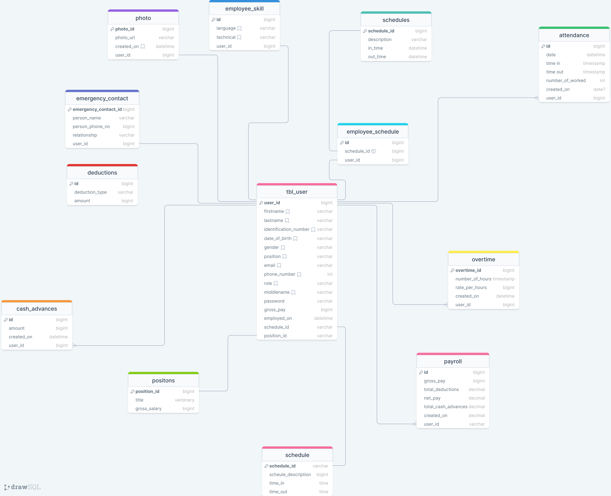

# Clockify

Attendance and Payroll System 

## Design-Figma

**[Figma Design](https://www.figma.com/file/F8fNhftlOgkTwzYRLdV3HZ/Attendance-and-Payroll-Systeme-Design?type=design&mode=design&t=ZD2M6riJ3RoFtSft-0)**

**[Wireframe](https://www.figma.com/file/KuSJ3vfhwlSIz1K722V4aI/Attendance-and-Payroll-System?type=design&node-id=0-1&mode=design&t=cXUzvFeBs1RpQp8f-0)**

## Database-Design

## Project Description
This project is aimed at simplifying the management of employee attendance, payroll, and related functionalities within a company. It will be developed using React.js for the front end, Express.js for the backend, and Microsoft SQL for the database.

Project Structure:

Frontend (React.js):

· Common Features:

o Login/Logout for Admin and Employee

o Dashboard (Different views for Admin and Employee)

o Profile Management (View, Edit, Change Password, Upload Photo)

· Admin Specific Features:

o Employee Management (Add, Edit, Remove, View)

o Upon employee Registration, send an email notification.

o Attendance Reports (View Monthly Attendance, Attendance Statistics in Bar Graph, export reports as a pdf file)

o Overtime Management (Add, Edit, View)

o Advance Cash Management (Add, View)

o Schedule Management (Add, Edit, View)

o Deduction Management (Add, Edit, View)

o Position Management (Add, Edit, View)

o Payroll Management (Generate, View)

· Employee Specific Features:

o Time In/Time Out

o View Own Attendance

o View Payroll

Backend (Express.js):

· Authentication:

o Login Authentication

o Token Generation and Validation

· Employee Management:

o CRUD Operations for Employee Details

· Attendance Management:

o Record Time In/Time Out

o Generate Attendance Reports

· Overtime, Advance Cash, Schedules, Deductions, and Positions:

o CRUD Operations for Each

· Payroll Management:

o Automatic Payroll Calculation

o Generate Payroll Reports

Database (Microsoft SQL):

· Tables:

o Employees: Stores employee details (ID, First Name, Last Name, Address, Birth Date, Contact Info, Gender, Position, Schedule, Photo URL, Email)

o Attendance: Logs of employee time in and time out (Employee ID, Date, Time In, Time Out)

o Overtime: Details of overtime hours (Employee ID, Date, Hours, Minutes, Rate)

o Advance Cash: Records of cash advances (Employee ID, Date, Amount)

o Schedules: Employee schedules (Employee ID, Start Time, End Time, Days)

o Deductions: Types of deductions (Deduction ID, Description, Amount)

o Positions: Job positions (Position ID, Title)

o Payroll: Payroll records (Employee ID, Gross Pay, Deductions, Net Pay, Payroll Date)

· Use Other necessary tables if possible.
## Login Page

## Sign up Page 

# To set up the project

## Clockify Client

## Overview

This repository contains a React project set up using [Vite](https://vitejs.dev/). Follow the instructions below to get started with the project locally.

## Prerequisites

Ensure you have the following installed:

- **[Node.js](https://nodejs.org/)** (includes npm or Yarn)
- **pnpm** (comes with Node.js) or **Yarn** (alternative package manager)

## Getting Started

### Clone the Repository

Clone this repository to your local machine:

- git clone https://github.com/stevehotcodes/clockify_client.git

## Navigate to the Project Directory
`cd your-repository-name`

## Install Dependencies
`pnpm install` or `pnpm install`

# Start the Development Server

- Depending on the setup, start the development server using one of the following commands:
-For Vite :
 `pnpm run dev`

# Project Structure

- public/: Contains static files like index.html.
- src/: Contains React components and JavaScript files.
- package.json: Manages project dependencies and scripts.

# Additional Setup
- Version Control: Initialize a git repository if not already initialized.
`git init`

- Code Editor: : Use an IDE or code editor like Visual Studio Code for better development experience.
- Add Additional Libraries: Install any extra libraries required for your project. For example:
    - React Router: For routing: `pnpm install react-router-dom` or `yarn add react-router-dom`
    - State Management: Libraries like Redux: `pnpm install redux react-redux` or yarn add redux react-redux
    - Styling: Libraries like SASS :`pnpm run sass`

Resources
**[React Documentation](https://react.dev/)**
**[Vite Documentation](https://vitejs.dev/)**
# Contributing
- We welcome contributions to this project! Please submit issues or pull requests with your suggestions or improvements.

